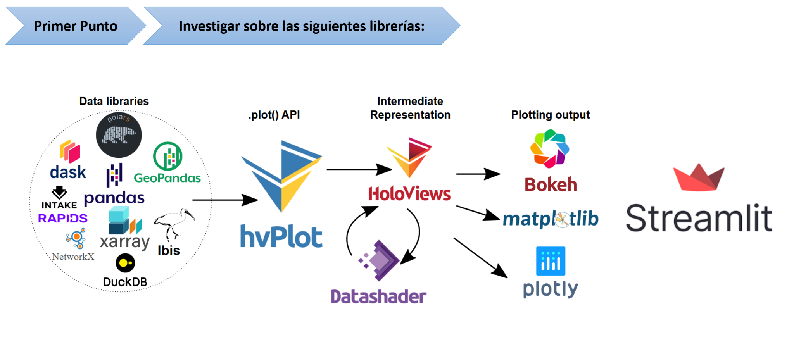
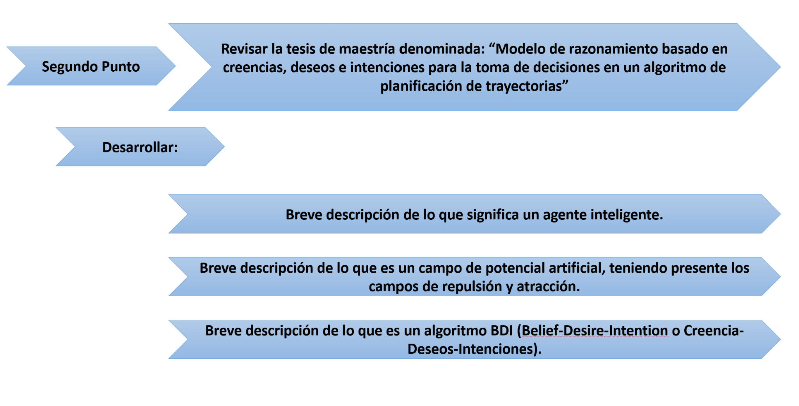

# Primer Punto — Ecosistema de Visualización Interactiva en Python (hvPlot · HoloViews · Datashader · Bokeh/Matplotlib/Plotly · Streamlit)

> **Objetivo.** Presentar, de manera práctica y académica, cómo se articula el ecosistema de visualización basado en **hvPlot** y **HoloViews**, cómo **Datashader** permite escalar a millones de puntos, qué salidas de *rendering* soportan (**Bokeh**, **Matplotlib**, **Plotly**) y cómo **Streamlit** sirve para desplegar prototipos o aplicaciones de *data apps*. Se incluyen descripciones, casos de uso y fragmentos de código mínimos.

---

## Tabla de contenidos
1. [Arquitectura general](#arquitectura-general)
2. [Datos de entrada (pandas, GeoPandas, Dask, xarray, Polars)](#datos-de-entrada)
3. [hvPlot: API rápida tipo `.plot()`](#hvplot)
4. [HoloViews: representación declarativa](#holoviews)
5. [Datashader: visualización a gran escala](#datashader)
6. [Motores de renderizado: Bokeh / Matplotlib / Plotly](#motores-de-renderizado)
7. [Streamlit: despliegue en apps](#streamlit)
8. [Guías de elección](#guias-de-eleccion)
9. [Reproducibilidad (entorno sugerido)](#reproducibilidad)
10. [Referencias básicas](#referencias)

---

## Arquitectura general



**Flujo conceptual:**

- **Data libraries:** `pandas`, `GeoPandas`, `xarray`, `polars`, `Dask` (y afines) → estructuras tabulares o matriciales.
- **hvPlot** expone un **API tipo `.plot()`** unificado para esas estructuras.
- **HoloViews** provee una **representación intermedia declarativa** (objetos `Curve`, `Points`, `Image`, `Polygons`…), conmutando **backends** de salida.
- **Datashader** rasteriza datos masivos y se integra con HoloViews/hvPlot.
- **Backends de salida:** **Bokeh** (interactivo web por defecto), **Matplotlib** (estático/impresión), **Plotly** (interactividad JS).
- **Streamlit** orquesta una interfaz de usuario simple para empaquetar visualizaciones como aplicación web.

---

## Datos de entrada
Las siguientes bibliotecas suministran estructuras de datos con soporte nativo en hvPlot/HoloViews:

- **pandas / GeoPandas:** tablas; *geometrías* (`Point`, `LineString`, `Polygon`) en columnas `geometry` (CRS).
- **xarray:** *N-D labeled arrays*; ideal para series temporales, rejillas y datos científicos.
- **Dask:** *out-of-core* y paralelismo; permite trabajar con datos más grandes que la memoria.
- **polars:** *DataFrames* rápidos basados en Apache Arrow (soporte vía conversión o extensiones).
- (Otros: DuckDB, Ibis, NetworkX, RAPIDS, Intake, etc., integrables vía exportación a DataFrame).

> **Instalación mínima (conda):**
> ```bash
> conda install -c conda-forge pandas geopandas xarray dask hvplot holoviews datashader bokeh matplotlib plotly streamlit
> ```

---

## hvPlot
**¿Qué es?** Una capa muy ligera que añade un método `.hvplot` a DataFrames/Series (y estructuras compatibles) para obtener gráficos interactivos **sin cambiar** de paradigma respecto a `pandas.plot()`.

**Para qué sirve / campos:** *Exploración rápida* de datos tabulares/espaciales; *prototipado*; docencia; *dashboards* simples.

**Cómo funciona (idea):** mapea columnas a **canales visuales** (x, y, color, tamaño, agregación) y delega la construcción del objeto declarativo a **HoloViews**, que a su vez lo renderiza con el *backend* por defecto (usualmente **Bokeh**).

**Ejemplo mínimo** (tabla temporal):

```python
import pandas as pd, numpy as np
import hvplot.pandas  # habilita df.hvplot

t = pd.date_range("2025-01-01", periods=200, freq="D")
df = pd.DataFrame({"fecha": t, "y": np.sin(np.linspace(0, 8, t.size))})
plot = df.hvplot(x="fecha", y="y", kind="line", title="Serie temporal (hvPlot)")
plot
```

**Geo** con `GeoPandas`:

```python
import geopandas as gpd, hvplot.pandas  # noqa: F401
gdf = gpd.read_file(gpd.datasets.get_path("naturalearth_lowres"))
gdf.hvplot(geo=True, tiles="OSM", hover_cols=["name"], color="continent")
```

---

## HoloViews
**¿Qué es?** Un marco **declarativo**: el usuario describe **lo que** quiere representar, no **cómo** dibujarlo. Produce objetos componibles (`+`, `*`, `layout`, `overlay`) y *responsive* a widgets.

**Para qué sirve / campos:** análisis exploratorio, ciencia de datos, visualización científica, interfaces interactivas con *sliders*, *selectors*, *linked brushing*.

**Cómo funciona (idea):** crea objetos de alto nivel (`hv.Curve`, `hv.Points`, `hv.Image`, `hv.Polygons`) y los convierte a la sintaxis del *backend* elegido (**Bokeh**, **Matplotlib** o **Plotly**).

**Ejemplo mínimo:**

```python
import numpy as np, holoviews as hv
hv.extension("bokeh")  # o "matplotlib"/"plotly"

x = np.linspace(0, 10, 200)
curve = hv.Curve((x, np.sin(x)), label="Seno")
scatter = hv.Scatter((x, np.cos(x)), label="Coseno")
(curve * scatter).opts(width=600, height=300, title="Composición en HoloViews")
```

---

## Datashader
**¿Qué es?** Librería para **rasterizar** millones (o miles de millones) de puntos/polígonos en **imágenes** agregadas, evitando sobrecarga del navegador.

**Para qué sirve / campos:** *big data* geoespacial, *time series* densas, nubes de puntos, trayectorias, mapas de calor.

**Cómo funciona (idea):** en lugar de enviar cada marca al navegador, computa **agregaciones por píxel** (conteo, suma, media…) en el servidor/local y genera una **imagen** que luego se superpone en el lienzo interactivo (vía HoloViews/hvPlot).

**Ejemplo mínimo con hvPlot (activación automática):**

```python
import pandas as pd, numpy as np, hvplot.pandas  # noqa: F401

n = 2_000_000
df = pd.DataFrame({"x": np.random.randn(n), "y": np.random.randn(n)})
# rasterize=True delega a Datashader
df.hvplot.points("x", "y", rasterize=True, aggregator="count", cnorm="eq_hist")
```

---

## Motores de renderizado
### Bokeh
- **Foco:** interactividad Web (zoom, hover, selección, *linked brushing*, *Bokeh Server*).
- **Uso típico:** *dashboards* y notebooks.
- **Ejemplo:**

```python
from bokeh.plotting import figure, show
p = figure(title="Bokeh básico")
p.line([1,2,3], [3,2,1], line_width=2)
show(p)
```

### Matplotlib
- **Foco:** publicación académica, control fino, formatos estáticos (PNG/SVG/PDF).
- **Ejemplo:**

```python
import matplotlib.pyplot as plt
plt.figure()
plt.plot([1,2,3], [3,2,1])
plt.title("Matplotlib básico")
plt.show()
```

### Plotly
- **Foco:** interactividad **JavaScript** con *tooltips*, exportación HTML, soporte 3D.
- **Ejemplo:**

```python
import plotly.express as px
df = px.data.iris()
px.scatter(df, x="sepal_width", y="sepal_length", color="species",
           title="Iris con Plotly")
```

---

## Streamlit
**¿Qué es?** *Framework* para construir **aplicaciones de datos** en Python con muy poco código.

**Para qué sirve / campos:** demostraciones, prototipos de analítica, *dashboards* livianos, formularios y carga de datos.

**Cómo funciona (idea):** cada ejecución del script genera una **página reactiva**; los *widgets* (selectbox, slider, file_uploader) invalidan el estado y recomputan.

**Ejemplo mínimo integrando hvPlot:**

```python
# streamlit_app.py
import streamlit as st, pandas as pd, numpy as np
import hvplot.pandas  # habilita hvPlot
from holoviews import opts

st.title("Demo hvPlot + Streamlit")
n = st.slider("n puntos", 100, 5000, 1000, step=100)
df = pd.DataFrame({"x": np.random.randn(n), "y": np.random.randn(n)})
plot = df.hvplot.scatter("x", "y").opts(opts.Scatter(width=600, height=400))
st.bokeh_chart(hv.render(plot, backend="bokeh"))
```

> Ejecutar: `streamlit run streamlit_app.py`.

---

## Guías de elección
- **Exploración rápida:** `hvPlot` sobre `pandas/GeoPandas/xarray`.
- **Composición avanzada/Widgets:** `HoloViews` (+ `panel` si requiere UI compleja).
- **Datos masivos:** activar `rasterize=True` (hvPlot/HoloViews) → **Datashader**.
- **Salida estática de alta calidad:** **Matplotlib**.
- **Web JS embebible o 3D:** **Plotly**.
- **App ligera para compartir:** **Streamlit**.

---

## Reproducibilidad
**`environment.yml` sugerido:**

```yaml
name: vis-ecosystem
channels: [conda-forge]
dependencies:
  - python=3.11
  - pandas
  - geopandas
  - xarray
  - dask
  - hvplot
  - holoviews
  - datashader
  - bokeh
  - matplotlib
  - plotly
  - streamlit
```

---

## Referencias
- Documentación oficial: hvPlot · HoloViews · Datashader · Bokeh · Matplotlib · Plotly · Streamlit.
- Guías introductorias y galerías de ejemplos en los sitios oficiales de cada proyecto.



# Segundo Punto — Investigación sobre Agentes Inteligentes, Campos de Potencial Artificial y el Modelo BDI

> **Referencia base:** Infante Moreno, Willson (2025). *Modelo de razonamiento basado en creencias, deseos e intenciones para la toma de decisiones en un algoritmo de planificación de trayectorias*. Universidad Distrital Francisco José de Caldas, Maestría en Ingeniería.

---

## Tabla de contenidos
1. [Introducción](#introducción)
2. [¿Qué es un agente inteligente?](#qué-es-un-agente-inteligente)
3. [Campos de potencial artificial](#campos-de-potencial-artificial)
4. [El modelo BDI (Belief–Desire–Intention)](#el-modelo-bdi-beliefdesireintention)
5. [Conclusiones](#conclusiones)
6. [Referencias](#referencias)

---

## Introducción

La tesis de Willson Infante Moreno (2025) aborda la navegación autónoma de robots móviles en entornos complejos. Para mejorar el método clásico de **campos de potencial artificial (APF)**, que puede llevar a mínimos locales, el autor propone integrar el modelo cognitivo **BDI (Belief–Desire–Intention)**, utilizado en agentes inteligentes.  
El resultado es un algoritmo capaz de tomar decisiones más informadas, permitiendo al robot evitar trampas de mínimos locales y optimizar sus trayectorias.

---

## ¿Qué es un agente inteligente?

Un **agente inteligente** es una entidad, física (robot) o virtual (software), capaz de:  
- **Percibir** su entorno mediante sensores o entradas de datos.  
- **Razonar** con base en la información recibida (procesamiento cognitivo o algorítmico).  
- **Actuar** sobre su entorno mediante actuadores o salidas de software.  
- **Aprender** y adaptarse a cambios para optimizar su desempeño.

En palabras de Wooldridge (2002), un agente es un sistema computacional autónomo que interactúa en un entorno para lograr objetivos, tomando decisiones racionales de acuerdo con sus **percepciones, conocimientos y metas**.

**Ejemplo de un agente inteligente en Python:**

```python
class AgenteInteligente:
    def __init__(self, nombre):
        self.nombre = nombre
        self.creencias = {}
        self.objetivo = None

    def percibir(self, entorno):
        self.creencias.update(entorno)

    def decidir(self):
        if "obstaculo" in self.creencias:
            return "evadir"
        return "avanzar"

    def actuar(self, accion):
        print(f"{self.nombre} ejecuta la acción: {accion}")

# Simulación simple
robot = AgenteInteligente("R2-D2")
robot.percibir({"obstaculo": True})
accion = robot.decidir()
robot.actuar(accion)
```

---

## Campos de potencial artificial

El método de **campos de potencial artificial (Artificial Potential Fields, APF)** modela el movimiento de un robot en un entorno como si estuviera sometido a fuerzas virtuales:

- **Campo de atracción:** generado por el objetivo, que “tira” del robot hacia la meta.  
- **Campo de repulsión:** generado por los obstáculos, que “empujan” al robot lejos de ellos.  

El robot sigue la trayectoria resultante de la suma de ambos campos:

\[
\vec{F}_{nav} = \vec{F}_{atracción} + \vec{F}_{repulsión}
\]

**Ventajas:**  
- Simple de implementar.  
- Computacionalmente eficiente.  
- Adecuado para entornos dinámicos.  

**Limitaciones:**  
- Posibilidad de quedar atrapado en **mínimos locales**, donde la fuerza neta es cero antes de llegar al objetivo.  
- Oscilaciones en pasajes estrechos o cerca de obstáculos.  

**Ejemplo en Python:**

```python
import numpy as np

def campo_potencial(pos, objetivo, obstaculos):
    # Fuerza de atracción
    F_attr = objetivo - pos
    # Fuerzas de repulsión
    F_rep = np.sum([(pos - obs)/np.linalg.norm(pos - obs)**2 for obs in obstaculos], axis=0)
    return F_attr + F_rep

# Simulación simple
pos = np.array([0.0, 0.0])
objetivo = np.array([5.0, 5.0])
obstaculos = [np.array([2.0, 2.0]), np.array([3.0, 4.0])]
print("Vector de fuerza resultante:", campo_potencial(pos, objetivo, obstaculos))
```

---

## El modelo BDI (Belief–Desire–Intention)

El **modelo BDI**, inspirado en la teoría filosófica de Michael Bratman, estructura la toma de decisiones de un agente en tres componentes fundamentales:

- **Beliefs (Creencias):** conocimiento que el agente tiene del entorno (posición, obstáculos, estado propio).  
- **Desires (Deseos):** objetivos o metas que quiere alcanzar.  
- **Intentions (Intenciones):** planes y acciones seleccionadas para cumplir los deseos, considerando las creencias actuales.

**Funcionamiento en la planificación de trayectorias:**  
1. El robot forma creencias sobre su entorno (mapa, obstáculos, objetivo).  
2. Define deseos (alcanzar el destino, evitar colisiones, minimizar tiempo).  
3. Genera intenciones (acciones concretas como girar, avanzar, retroceder).  
4. Ajusta dinámicamente sus intenciones si detecta un mínimo local en APF.  

**Ejemplo mínimo en pseudocódigo:**

```python
creencias = {"obstaculos": [(2,2), (3,3)], "posicion": (0,0)}
deseos = ["llegar_objetivo"]
intenciones = []

if "llegar_objetivo" in deseos:
    if (2,2) in creencias["obstaculos"]:
        intenciones.append("evadir")
    else:
        intenciones.append("avanzar")

print("Intenciones seleccionadas:", intenciones)
```

---

## Conclusiones

- Los **agentes inteligentes** permiten modelar sistemas autónomos que perciben, razonan y actúan.  
- Los **campos de potencial artificial** son una técnica eficiente pero limitada para la navegación de robots.  
- La integración del modelo **BDI** al método APF mejora la capacidad del robot para evitar **mínimos locales** y tomar decisiones más cercanas al razonamiento humano.  
- Esto abre la puerta a aplicaciones en **robótica de servicio, exploración autónoma y navegación en entornos dinámicos**.

---

## Referencias

- Infante Moreno, W. (2025). *Modelo de razonamiento basado en creencias, deseos e intenciones para la toma de decisiones en un algoritmo de planificación de trayectorias*. Universidad Distrital Francisco José de Caldas.  
- Wooldridge, M. (2002). *An Introduction to MultiAgent Systems*. Wiley.  
- Bratman, M. (1987). *Intentions, Plans, and Practical Reason*. Harvard University Press.  
- Khatib, O. (1986). *Real-time obstacle avoidance for manipulators and mobile robots*. The International Journal of Robotics Research, 5(1), 90-98.  
